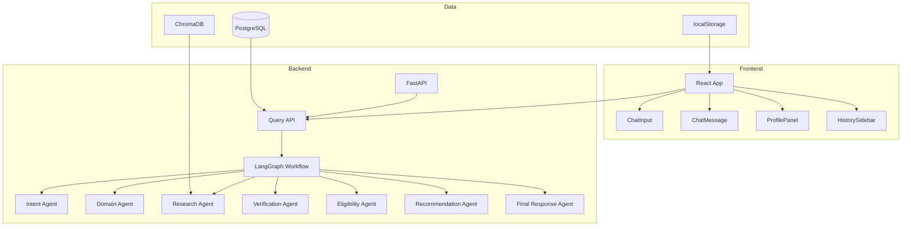
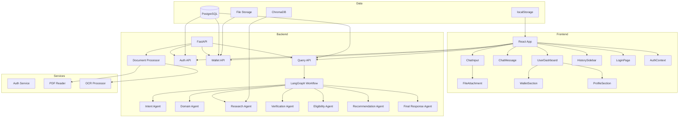
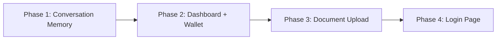
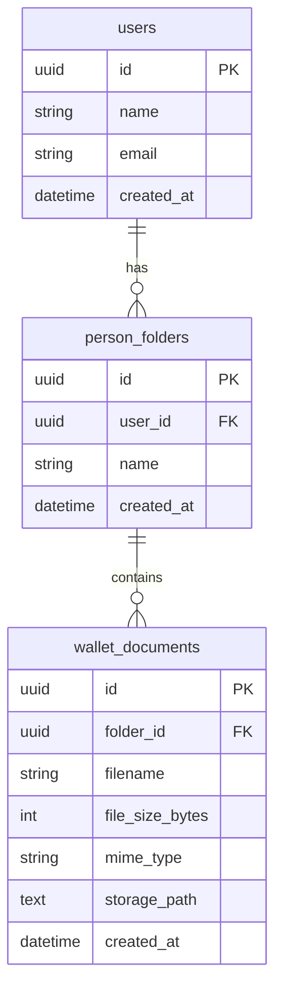
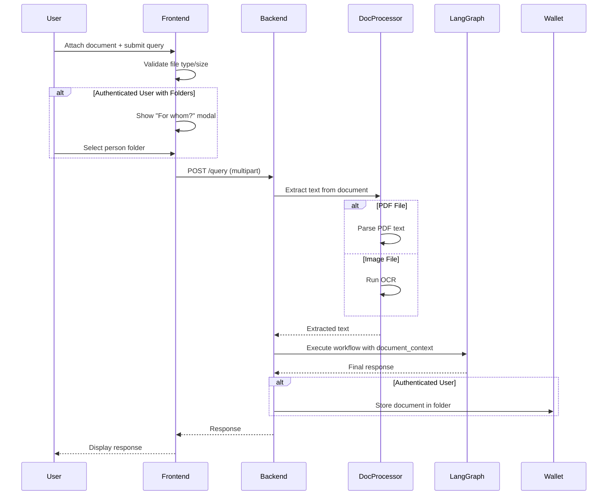
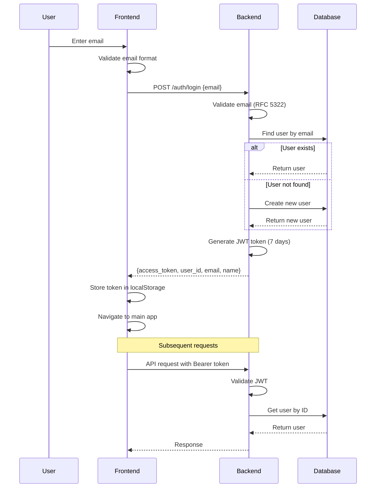
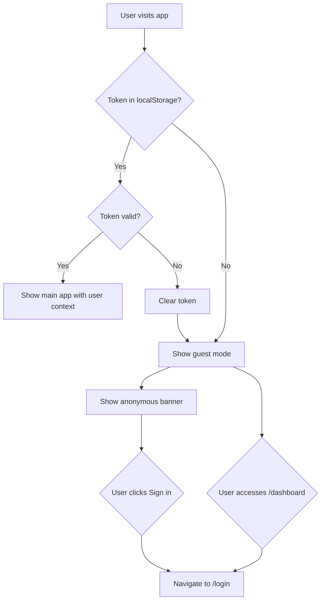
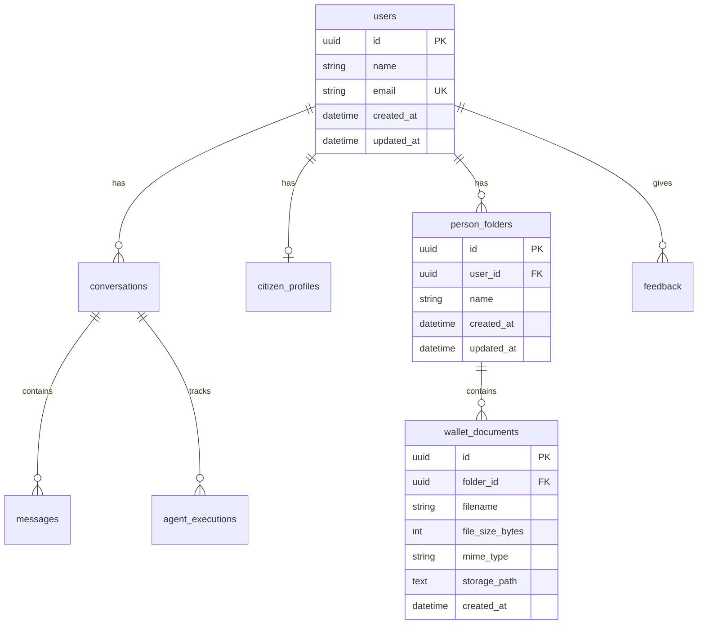

# Design Document: PolicyPilot Enhancements

## Document Information

| Property          | Value                                |
| ----------------- | ------------------------------------ |
| **Spec ID**       | 57870c15-0515-450a-8d7b-5a875b2c7de2 |
| **Workflow Type** | Requirements-First                   |
| **Spec Type**     | Feature                              |
| **Version**       | 1.0                                  |
| **Created**       | 2025-01-09                           |

---

## Table of Contents

1. [Overview](#overview)
2. [Architecture](#architecture)
3. [Phase 1: Persistent Conversation Memory](#phase-1-persistent-conversation-memory)
4. [Phase 2: User Dashboard + Document Wallet](#phase-2-user-dashboard--document-wallet)
5. [Phase 3: Document Upload + Smart Processing](#phase-3-document-upload-during-chat--smart-processing)
6. [Phase 4: Login Page (Email Authentication)](#phase-4-login-page-email-authentication)
7. [API Design](#api-design)
8. [Database Schema Changes](#database-schema-changes)
9. [Security Considerations](#security-considerations)
10. [Technology Choices](#technology-choices)
11. [Testing Strategy](#testing-strategy)

---

## Overview

### Purpose

This document defines the technical design for four sequential enhancements to the PolicyPilot application — an AI-powered Government Scheme Discovery and Eligibility platform. Each feature is designed as an independent phase that can be built, tested, and approved before the next phase begins.

### Feature Summary

| Phase | Feature                            | Description                                                                                                |
| ----- | ---------------------------------- | ---------------------------------------------------------------------------------------------------------- |
| 1     | Persistent Conversation Memory     | Ensure all LangGraph agents use conversation history for contextual follow-up answers                      |
| 2     | User Dashboard + Document Wallet   | Replace the static profile panel with a user dashboard containing folder-based document management         |
| 3     | Document Upload + Smart Processing | Allow users to upload documents during chat, store them in the wallet, and use them for eligibility checks |
| 4     | Login Page (Email Auth)            | Add email-based login flow for persistent identity across the application                                  |

### Design Principles

1. **Sequential Implementation**: Each phase is independently deployable and testable
2. **Backward Compatibility**: Anonymous users remain supported throughout
3. **Minimal Disruption**: Existing API contracts are preserved where possible
4. **Separation of Concerns**: Each component has a single responsibility
5. **Security First**: Authentication and authorization are designed in from Phase 4

---

## Architecture

### Current System Architecture



### Target Architecture (All Phases Complete)



### Phase Dependency Graph



---

## Phase 1: Persistent Conversation Memory

### Objective

Ensure all LangGraph agents properly consume and use conversation history for contextual follow-up answers.

### Current State Analysis

**What Already Works:**

- The `PolicyPilotState` already has a `conversation_history: list[dict[str, str]]` field
- The `IntentAgent` already accepts and uses `conversation_history` in its LLM prompts
- The `FinalResponseAgent` already accepts and uses `conversation_history` in its LLM prompts
- The frontend `useQuery` hook already builds conversation history from chat messages
- The frontend sends `conversation_history` in API requests

**What Needs Work:**

- Server-side history accumulation for conversation continuity
- Frontend history construction refinements
- Validation and error handling for malformed history entries

### Components and Interfaces

#### Backend Changes

##### 1. Server-Side History Store

Create a new service for managing server-side conversation history:

```python
# backend/app/services/conversation_history_service.py

class ConversationHistoryService:
    """
    Manages server-side conversation history accumulation.
    """

    def __init__(self):
        self._history_store: dict[str, list[dict[str, str]]] = {}

    def get_history(self, conversation_id: str) -> list[dict[str, str]]:
        """Retrieve history for a conversation_id."""

    def append_to_history(
        self,
        conversation_id: str,
        role: str,
        content: str
    ) -> None:
        """Append a message to the conversation history."""

    def truncate_history(
        self,
        conversation_id: str,
        max_entries: int = 20
    ) -> None:
        """Truncate history to the most recent entries."""

    def initialize_history(self, conversation_id: str) -> None:
        """Initialize an empty history for a new conversation_id."""
```

##### 2. Query API Enhancement

Modify the query API endpoint to integrate server-side history:

```python
# backend/app/api/v1/query.py

@router.post("/query")
async def process_query(request: QueryRequest):
    # 1. Determine conversation_id
    conversation_id = request.conversation_id or str(uuid.uuid4())

    # 2. Get server-side history
    server_history = history_service.get_history(conversation_id)

    # 3. Determine authoritative history source
    if request.conversation_history:
        authoritative_history = request.conversation_history
    else:
        authoritative_history = server_history

    # 4. Truncate to 20 entries
    authoritative_history = authoritative_history[-20:]

    # 5. Execute workflow with history
    result = await workflow.run(
        query=request.query,
        conversation_history=authoritative_history,
        user_profile=request.user_profile,
    )

    # 6. Append to server-side history
    history_service.append_to_history(
        conversation_id, "user", request.query
    )
    history_service.append_to_history(
        conversation_id, "assistant", result.final_response
    )

    return {**result, "conversation_id": conversation_id}
```

##### 3. History Entry Validation

```python
def validate_history_entry(entry: dict) -> bool:
    """Check if a history entry has required fields."""
    return (
        isinstance(entry, dict) and
        "role" in entry and
        "content" in entry and
        entry["role"] in ("user", "assistant") and
        isinstance(entry["content"], str)
    )
```

#### Frontend Changes

##### 1. Enhanced History Construction

The existing `buildConversationHistory` function in `useQuery.js` already handles the core logic. Minor enhancements for capping to 20 entries:

```javascript
function buildConversationHistory(messages) {
  if (!messages || messages.length === 0) return [];

  const history = [];

  for (const msg of messages) {
    if (msg.sender === "user" && msg.text) {
      history.push({ role: "user", content: msg.text });
    } else if (msg.sender === "assistant" && msg.data?.final_response) {
      history.push({ role: "assistant", content: msg.data.final_response });
    }
  }

  // Cap to 20 most recent entries
  return history.slice(-20);
}
```

### Error Handling

| Error Condition               | Handling                                         |
| ----------------------------- | ------------------------------------------------ |
| Malformed history entry       | Skip the entry, log warning, continue processing |
| Missing conversation_id       | Generate a new UUID and initialize fresh history |
| History exceeds 20 entries    | Truncate to most recent 20 entries               |
| Server-side history not found | Initialize empty history and proceed             |

### Testing Strategy

#### Unit Tests

1. **ConversationHistoryService**
   - Test history initialization, appending, truncation
   - Test retrieval of non-existent conversation

2. **History Entry Validation**
   - Test valid entries pass validation
   - Test entries missing `role` or `content` are rejected

#### Integration Tests

1. **Query API with History**
   - Test first query creates new conversation_id
   - Test follow-up query uses history
   - Test frontend-provided history overrides server history

---

## Phase 2: User Dashboard + Document Wallet

### Objective

Create a user dashboard with a folder-based document management system (Document Wallet).

### Components and Interfaces

#### Backend Components

##### 1. New Database Models

```python
# backend/app/models/person_folder.py

class PersonFolder(Base):
    """A named folder in a user's document wallet."""
    __tablename__ = "person_folders"

    id: Mapped[uuid.UUID] = mapped_column(primary_key=True, default=uuid.uuid4)
    user_id: Mapped[uuid.UUID] = mapped_column(
        ForeignKey("users.id", ondelete="CASCADE"), nullable=False, index=True
    )
    name: Mapped[str] = mapped_column(String(150), nullable=False)
    created_at: Mapped[datetime] = mapped_column(DateTime(timezone=True), default=datetime.utcnow)
    updated_at: Mapped[datetime] = mapped_column(
        DateTime(timezone=True), default=datetime.utcnow, onupdate=datetime.utcnow
    )

    user: Mapped["User"] = relationship(back_populates="folders")
    documents: Mapped[list["WalletDocument"]] = relationship(
        back_populates="folder", cascade="all, delete-orphan"
    )
```

```python
# backend/app/models/wallet_document.py

class WalletDocument(Base):
    """A document stored in a user's document wallet."""
    __tablename__ = "wallet_documents"

    id: Mapped[uuid.UUID] = mapped_column(primary_key=True, default=uuid.uuid4)
    folder_id: Mapped[uuid.UUID] = mapped_column(
        ForeignKey("person_folders.id", ondelete="CASCADE"), nullable=False, index=True
    )
    filename: Mapped[str] = mapped_column(String(255), nullable=False)
    file_size_bytes: Mapped[int] = mapped_column(Integer, nullable=False)
    mime_type: Mapped[str] = mapped_column(String(100), nullable=False)
    storage_path: Mapped[str] = mapped_column(Text, nullable=False)
    created_at: Mapped[datetime] = mapped_column(DateTime(timezone=True), default=datetime.utcnow)

    folder: Mapped["PersonFolder"] = relationship(back_populates="documents")
```

##### 2. API Endpoints

```python
# backend/app/api/v1/wallet.py

router = APIRouter(prefix="/wallet", tags=["Wallet"])

# === Folder Endpoints ===

@router.get("/folders")
async def list_folders(current_user: User = Depends(get_current_user)) -> list[PersonFolderResponse]:
    """List all PersonFolders for the authenticated user, ordered by creation date."""

@router.post("/folders", status_code=201)
async def create_folder(
    request: CreateFolderRequest, current_user: User = Depends(get_current_user)
) -> PersonFolderResponse:
    """Create a new PersonFolder. Validates name is not empty/whitespace-only."""

@router.delete("/folders/{folder_id}", status_code=204)
async def delete_folder(folder_id: UUID, current_user: User = Depends(get_current_user)) -> None:
    """Delete a PersonFolder and all its documents. Returns 403 if not owner."""

# === Document Endpoints ===

@router.get("/folders/{folder_id}/documents")
async def list_documents(
    folder_id: UUID, current_user: User = Depends(get_current_user)
) -> list[WalletDocumentResponse]:
    """List all documents in a folder. Returns 403 if folder not owned by user."""

@router.post("/folders/{folder_id}/documents", status_code=201)
async def upload_document(
    folder_id: UUID, file: UploadFile, current_user: User = Depends(get_current_user)
) -> WalletDocumentResponse:
    """Upload a document to a folder. Validates MIME type and file size."""

@router.delete("/documents/{document_id}", status_code=204)
async def delete_document(
    document_id: UUID, current_user: User = Depends(get_current_user)
) -> None:
    """Delete a document. Returns 403 if document not owned by user."""
```

##### 3. Request/Response Schemas

```python
# backend/app/schemas/wallet.py

class CreateFolderRequest(BaseModel):
    name: str = Field(..., min_length=1, max_length=150)

class PersonFolderResponse(BaseModel):
    id: UUID
    name: str
    created_at: datetime
    class Config:
        from_attributes = True

class WalletDocumentResponse(BaseModel):
    id: UUID
    folder_id: UUID
    filename: str
    file_size_bytes: int
    mime_type: str
    created_at: datetime
    class Config:
        from_attributes = True
```

##### 4. File Storage Service

```python
# backend/app/services/file_storage_service.py

class FileStorageService:
    """Handles persistent storage of uploaded documents."""

    ALLOWED_MIME_TYPES = {"application/pdf", "image/jpeg", "image/png", "image/webp"}
    MAX_FILE_SIZE_BYTES = 10 * 1024 * 1024  # 10 MB

    def __init__(self, storage_root: str = "storage/wallet"):
        self.storage_root = Path(storage_root)
        self.storage_root.mkdir(parents=True, exist_ok=True)

    def validate_file(self, file: UploadFile) -> tuple[bool, str]:
        """Validate file size and MIME type."""

    async def store_file(self, file: UploadFile, user_id: UUID, folder_id: UUID) -> str:
        """Store file and return storage path."""

    def delete_file(self, storage_path: str) -> bool:
        """Delete file from storage."""
```

#### Frontend Components

##### 1. UserDashboard Page

```jsx
// frontend/src/pages/UserDashboard.jsx

export default function UserDashboard() {
  const { user, isAuthenticated, isLoading } = useAuth();
  const navigate = useNavigate();

  useEffect(() => {
    if (!isLoading && !isAuthenticated) {
      navigate("/login");
    }
  }, [isLoading, isAuthenticated, navigate]);

  if (isLoading) return <LoadingSpinner />;
  if (!isAuthenticated) return null;

  return (
    <div className="dashboard-container">
      <ProfileSection user={user} />
      <WalletSection />
    </div>
  );
}
```

##### 2. WalletSection Component

```jsx
// frontend/src/components/WalletSection.jsx

export default function WalletSection() {
  const { folders, loading, createFolder, deleteFolder } = useWallet();
  const [selectedFolderId, setSelectedFolderId] = useState(null);

  return (
    <div className="wallet-section">
      <h3>Document Wallet</h3>
      <CreateFolderForm onSubmit={createFolder} />

      {folders.map((folder) => (
        <FolderCard
          key={folder.id}
          folder={folder}
          isSelected={folder.id === selectedFolderId}
          onSelect={() => setSelectedFolderId(folder.id)}
          onDelete={() => deleteFolder(folder.id)}
        />
      ))}

      {selectedFolderId && <DocumentList folderId={selectedFolderId} />}
    </div>
  );
}
```

##### 3. DocumentList Component

```jsx
// frontend/src/components/DocumentList.jsx

export default function DocumentList({ folderId }) {
  const { documents, uploadDocument, deleteDocument } =
    useFolderDocuments(folderId);

  return (
    <div className="document-list">
      <DocumentUploadButton onUpload={(file) => uploadDocument(file)} />

      {documents.map((doc) => (
        <DocumentCard
          key={doc.id}
          document={doc}
          onDelete={() => deleteDocument(doc.id)}
        />
      ))}
    </div>
  );
}
```

##### 4. API Hook

```javascript
// frontend/src/hooks/useWallet.js

export function useWallet() {
  const [folders, setFolders] = useState([]);
  const [loading, setLoading] = useState(true);

  useEffect(() => {
    fetchFolders();
  }, []);

  const fetchFolders = async () => {
    const response = await apiClient.get("/wallet/folders");
    setFolders(response.data);
    setLoading(false);
  };

  const createFolder = async (name) => {
    const response = await apiClient.post("/wallet/folders", { name });
    setFolders([...folders, response.data]);
  };

  const deleteFolder = async (folderId) => {
    await apiClient.delete(`/wallet/folders/${folderId}`);
    setFolders(folders.filter((f) => f.id !== folderId));
  };

  return { folders, loading, createFolder, deleteFolder };
}
```

### Database Schema



### Alembic Migration

```python
# backend/alembic/versions/xxx_add_wallet_tables.py

def upgrade():
    op.create_table(
        'person_folders',
        sa.Column('id', postgresql.UUID(as_uuid=True), primary_key=True),
        sa.Column('user_id', postgresql.UUID(as_uuid=True),
                  sa.ForeignKey('users.id', ondelete='CASCADE'), nullable=False),
        sa.Column('name', sa.String(150), nullable=False),
        sa.Column('created_at', sa.DateTime(timezone=True), server_default=sa.func.now()),
        sa.Column('updated_at', sa.DateTime(timezone=True),
                  server_default=sa.func.now(), onupdate=sa.func.now()),
    )
    op.create_index('ix_person_folders_user_id', 'person_folders', ['user_id'])

    op.create_table(
        'wallet_documents',
        sa.Column('id', postgresql.UUID(as_uuid=True), primary_key=True),
        sa.Column('folder_id', postgresql.UUID(as_uuid=True),
                  sa.ForeignKey('person_folders.id', ondelete='CASCADE'), nullable=False),
        sa.Column('filename', sa.String(255), nullable=False),
        sa.Column('file_size_bytes', sa.Integer, nullable=False),
        sa.Column('mime_type', sa.String(100), nullable=False),
        sa.Column('storage_path', sa.Text, nullable=False),
        sa.Column('created_at', sa.DateTime(timezone=True), server_default=sa.func.now()),
    )
    op.create_index('ix_wallet_documents_folder_id', 'wallet_documents', ['folder_id'])

def downgrade():
    op.drop_table('wallet_documents')
    op.drop_table('person_folders')
```

### Error Handling

| Error Condition                 | HTTP Status | Response                                     |
| ------------------------------- | ----------- | -------------------------------------------- |
| Folder name is empty/whitespace | 422         | `{"detail": "Folder name cannot be empty"}`  |
| File exceeds 10MB               | 413         | `{"detail": "File size exceeds 10MB limit"}` |
| Invalid MIME type               | 415         | `{"detail": "File type not supported"}`      |
| Folder not owned by user        | 403         | `{"detail": "Access denied"}`                |
| Document not owned by user      | 403         | `{"detail": "Access denied"}`                |

### File Storage Strategy

```
storage/
└── wallet/
    └── {user_id}/
        └── {folder_id}/
            └── {document_id}.{extension}
```

---

## Phase 3: Document Upload During Chat + Smart Processing

### Objective

Allow users to upload documents during chat conversations, extract text content, and use it for eligibility checks.

### Components and Interfaces

#### Backend Components

##### 1. Document Processing Service

```python
# backend/app/services/document_processor.py

class DocumentProcessor:
    """Extracts text content from uploaded documents."""

    EXTRACTION_TIMEOUT_SECONDS = 30

    async def extract_text(self, file_content: bytes, mime_type: str) -> DocumentExtractionResult:
        """Extract text from document."""

    async def _extract_from_pdf(self, content: bytes) -> str:
        """Extract text from PDF using PDF reader."""

    async def _extract_from_image(self, content: bytes, mime_type: str) -> str:
        """Extract text from image using OCR."""
```

```python
# backend/app/schemas/document.py

class DocumentExtractionResult(BaseModel):
    text: str
    success: bool
    error_message: str | None = None
```

##### 2. PDF Reader Service

```python
# backend/app/services/pdf_reader.py

class PDFReader:
    """Extracts text from PDF documents using PyMuPDF (fitz)."""

    def extract_text(self, content: bytes) -> str:
        """Extract all readable text from PDF."""
```

##### 3. OCR Processor Service

```python
# backend/app/services/ocr_processor.py

class OCRProcessor:
    """Performs optical character recognition on images using pytesseract."""

    SUPPORTED_FORMATS = {"image/jpeg", "image/png", "image/webp"}

    def extract_text(self, image_content: bytes, mime_type: str) -> str:
        """Extract text from image using OCR."""
```

##### 4. Query API Enhancement for Document Upload

```python
# backend/app/api/v1/query.py

@router.post("/query")
async def process_query(
    query: str = Form(...),
    conversation_id: str | None = Form(None),
    conversation_history: str | None = Form(None),
    user_profile: str | None = Form(None),
    document: UploadFile | None = File(None),
    folder_id: str | None = Form(None),
    current_user: User | None = Depends(get_optional_user),
):
    """
    Process a query with optional document attachment.

    Flow:
    1. Extract text from document if provided
    2. Add extracted text to document_context in state
    3. Execute LangGraph workflow
    4. For authenticated users: store document in wallet if folder_id provided
    """
```

##### 5. LangGraph State Enhancement

```python
# backend/app/graph/state.py

class PolicyPilotState(TypedDict, total=False):
    # ... existing fields ...

    # NEW: Document context for eligibility checks
    document_context: str

    # NEW: Person folder selection
    selected_person_folder_id: str | None
```

##### 6. Eligibility Agent Enhancement

```python
# backend/app/agents/eligibility_agent.py

class EligibilityAgent:
    def run(self, state: PolicyPilotState) -> dict[str, Any]:
        user_profile = state.get("user_profile", {})
        document_context = state.get("document_context", "")

        # Merge document-derived information
        if document_context:
            extracted_info = self._extract_profile_from_document(document_context)
            # Document values only fill gaps in user_profile
            for key, value in extracted_info.items():
                if key not in user_profile or user_profile[key] is None:
                    user_profile[key] = value

        # Continue with eligibility evaluation...
```

##### 7. "For Whom?" Flow Handler

```python
# backend/app/services/person_selection_service.py

class PersonSelectionService:
    """Handles the 'For whom?' prompt logic for eligibility checks."""

    async def should_prompt_person_selection(self, user: User, intent: str) -> bool:
        """Check if we should prompt for person selection."""

    async def get_person_folders(self, user: User) -> list[PersonFolder]:
        """Get all person folders for user."""
```

#### Frontend Components

##### 1. File Attachment in ChatInput

```jsx
// frontend/src/components/ChatInput.jsx

const ACCEPTED_FILE_TYPES = [
  "application/pdf",
  "image/jpeg",
  "image/png",
  "image/webp",
];
const MAX_FILE_SIZE = 10 * 1024 * 1024; // 10 MB

export default function ChatInput({
  queryText,
  setQueryText,
  isLoading,
  onSubmit,
  attachedFile,
  setAttachedFile,
}) {
  const fileInputRef = useRef(null);
  const [fileError, setFileError] = useState(null);

  const handleFileSelect = (e) => {
    const file = e.target.files?.[0];
    if (!file) return;

    if (!ACCEPTED_FILE_TYPES.includes(file.type)) {
      setFileError("Invalid file type. Use PDF, JPEG, PNG, or WebP.");
      return;
    }

    if (file.size > MAX_FILE_SIZE) {
      setFileError("File size exceeds 10MB limit.");
      return;
    }

    setFileError(null);
    setAttachedFile(file);
  };

  return (
    <form onSubmit={handleSubmit}>
      {attachedFile && (
        <FilePreviewChip
          file={attachedFile}
          onRemove={() => setAttachedFile(null)}
        />
      )}

      {fileError && <div className="file-error">{fileError}</div>}

      <div className="input-row">
        <textarea
          value={queryText}
          onChange={(e) => setQueryText(e.target.value)}
        />

        <button type="button" onClick={() => fileInputRef.current?.click()}>
          <IconPaperclip />
        </button>

        <input
          ref={fileInputRef}
          type="file"
          accept={ACCEPTED_FILE_TYPES.join(",")}
          onChange={handleFileSelect}
          hidden
        />

        <button type="submit" disabled={isLoading || !queryText.trim()}>
          <IconSend />
        </button>
      </div>
    </form>
  );
}
```

##### 2. FilePreviewChip Component

```jsx
// frontend/src/components/FilePreviewChip.jsx

export default function FilePreviewChip({ file, onRemove }) {
  const formatFileSize = (bytes) => {
    if (bytes < 1024) return `${bytes} B`;
    if (bytes < 1024 * 1024) return `${(bytes / 1024).toFixed(1)} KB`;
    return `${(bytes / (1024 * 1024)).toFixed(1)} MB`;
  };

  return (
    <div className="file-preview-chip">
      <IconFile />
      <span>{file.name}</span>
      <span>{formatFileSize(file.size)}</span>
      <button onClick={onRemove}>
        <IconX />
      </button>
    </div>
  );
}
```

##### 3. "For Whom?" Person Selection Modal

```jsx
// frontend/src/components/PersonSelectionModal.jsx

export default function PersonSelectionModal({
  isOpen,
  folders,
  onSelect,
  onCancel,
}) {
  if (!isOpen) return null;

  return (
    <div className="modal-overlay">
      <div className="modal-content">
        <h3>For whom are you checking eligibility?</h3>
        <div className="folder-options">
          {folders.map((folder) => (
            <button key={folder.id} onClick={() => onSelect(folder)}>
              <IconFolder />
              <span>{folder.name}</span>
            </button>
          ))}
        </div>
        <button onClick={onCancel}>Skip</button>
      </div>
    </div>
  );
}
```

##### 4. useQuery Hook Enhancement

```javascript
// frontend/src/hooks/useQuery.js

export function useQuery() {
  const [attachedFile, setAttachedFile] = useState(null);
  const { user, isAuthenticated } = useAuth();
  const { folders } = useWallet();
  const [showPersonSelection, setShowPersonSelection] = useState(false);
  const [selectedFolder, setSelectedFolder] = useState(null);

  const runQuery = useCallback(
    async (customText) => {
      const textToRun = customText || queryText;
      if (!textToRun.trim() || isLoading) return;

      // Check if person selection needed
      if (
        isAuthenticated &&
        attachedFile &&
        folders.length > 0 &&
        !selectedFolder
      ) {
        setShowPersonSelection(true);
        return;
      }

      // Build form data
      const formData = new FormData();
      formData.append("query", textToRun.trim());
      formData.append("conversation_id", activeChat?.conversationId || "");
      formData.append(
        "conversation_history",
        JSON.stringify(conversationHistory),
      );
      formData.append("user_profile", JSON.stringify({}));

      if (attachedFile) formData.append("document", attachedFile);
      if (selectedFolder) formData.append("folder_id", selectedFolder.id);

      const response = await apiClient.post("/query", formData, {
        headers: { "Content-Type": "multipart/form-data" },
      });

      setAttachedFile(null);
      setSelectedFolder(null);
    },
    [
      /* deps */
    ],
  );

  return {
    attachedFile,
    setAttachedFile,
    showPersonSelection,
    setShowPersonSelection,
    selectedFolder,
    setSelectedFolder,
  };
}
```

### Data Flow Diagram



### Error Handling

| Error Condition    | HTTP Status | Response                                     |
| ------------------ | ----------- | -------------------------------------------- |
| PDF is encrypted   | 200         | User-friendly error in final_response        |
| OCR returns empty  | 200         | User-friendly error in final_response        |
| Extraction timeout | 200         | User-friendly error in final_response        |
| Invalid file type  | 415         | `{"detail": "File type not supported"}`      |
| File too large     | 413         | `{"detail": "File size exceeds 10MB limit"}` |

---

## Phase 4: Login Page (Email Authentication)

### Objective

Add email-based login flow so every user has a persistent identity used across the entire app.

### Components and Interfaces

#### Backend Components

##### 1. Auth Service

```python
# backend/app/services/auth_service.py

class AuthService:
    """Handles email-based authentication and JWT token management."""

    JWT_ALGORITHM = "HS256"
    JWT_EXPIRATION_DAYS = 7

    def __init__(self, secret_key: str):
        self.secret_key = secret_key

    def validate_email(self, email: str) -> bool:
        """Validate email format using RFC 5322 pattern."""

    def find_or_create_user(self, email: str) -> User:
        """Find existing user or create new one."""

    def create_jwt_token(self, user: User) -> str:
        """Generate JWT token for user."""

    def validate_jwt_token(self, token: str) -> User | None:
        """Validate JWT token and return user."""

    def decode_jwt_token(self, token: str) -> dict | None:
        """Decode JWT token without full validation."""
```

##### 2. API Endpoints

```python
# backend/app/api/v1/auth.py

router = APIRouter(prefix="/auth", tags=["Authentication"])

@router.post("/login")
async def login(request: LoginRequest) -> LoginResponse:
    """
    Login or register with email address.

    - Validates email format
    - Creates new user if not exists
    - Returns JWT token valid for 7 days
    """

class LoginRequest(BaseModel):
    email: str = Field(..., pattern=r"^[^@]+@[^@]+\.[^@]+$")

class LoginResponse(BaseModel):
    access_token: str
    token_type: str = "bearer"
    user_id: UUID
    email: str
    name: str | None


@router.get("/me")
async def get_current_user_info(
    current_user: User = Depends(get_current_user)
) -> UserInfoResponse:
    """Get current authenticated user info."""

class UserInfoResponse(BaseModel):
    user_id: UUID
    email: str
    name: str | None
```

##### 3. Auth Dependencies

```python
# backend/app/api/deps.py

from fastapi import Depends, HTTPException, status
from fastapi.security import HTTPBearer, HTTPAuthorizationCredentials

security = HTTPBearer(auto_error=False)

async def get_current_user(
    credentials: HTTPAuthorizationCredentials | None = Depends(security),
) -> User:
    """Dependency that requires authentication."""
    if not credentials:
        raise HTTPException(status_code=401, detail="Not authenticated")

    user = auth_service.validate_jwt_token(credentials.credentials)
    if not user:
        raise HTTPException(status_code=401, detail="Invalid or expired token")

    return user


async def get_optional_user(
    credentials: HTTPAuthorizationCredentials | None = Depends(security),
) -> User | None:
    """Dependency that optionally extracts user from token."""
    if not credentials:
        return None

    return auth_service.validate_jwt_token(credentials.credentials)
```

##### 4. User Model Enhancement

The existing User model already has the required fields:

- `id: UUID` — Primary key
- `name: str | None` — Optional display name
- `email: str | None` — Unique, indexed email address

Add relationship to PersonFolder:

```python
# backend/app/models/user.py (update)

class User(Base):
    # ... existing fields ...

    folders: Mapped[list["PersonFolder"]] = relationship(
        back_populates="user",
        cascade="all, delete-orphan",
    )
```

#### Frontend Components

##### 1. LoginPage Component

```jsx
// frontend/src/pages/LoginPage.jsx

export default function LoginPage() {
  const [email, setEmail] = useState("");
  const [error, setError] = useState(null);
  const [loading, setLoading] = useState(false);
  const { login, isAuthenticated } = useAuth();
  const navigate = useNavigate();

  useEffect(() => {
    if (isAuthenticated) {
      navigate("/");
    }
  }, [isAuthenticated, navigate]);

  const handleSubmit = async (e) => {
    e.preventDefault();
    setError(null);
    setLoading(true);

    try {
      await login(email);
      navigate("/");
    } catch (err) {
      setError(err.message);
    } finally {
      setLoading(false);
    }
  };

  return (
    <div className="login-page">
      <div className="login-card">
        <LogoMark />
        <h1>Welcome to PolicyPilot</h1>
        <p>Enter your email to continue</p>

        <form onSubmit={handleSubmit}>
          <input
            type="email"
            value={email}
            onChange={(e) => setEmail(e.target.value)}
            placeholder="your@email.com"
            required
          />

          {error && <div className="error">{error}</div>}

          <button type="submit" disabled={loading || !email}>
            {loading ? "Signing in..." : "Continue"}
          </button>
        </form>

        <p className="guest-prompt">
          Or continue as a <Link to="/">guest</Link>
        </p>
      </div>
    </div>
  );
}
```

##### 2. AuthContext Provider

```jsx
// frontend/src/contexts/AuthContext.jsx

const AuthContext = createContext(null);

export function AuthProvider({ children }) {
  const [user, setUser] = useState(null);
  const [loading, setLoading] = useState(true);

  useEffect(() => {
    checkAuth();
  }, []);

  const checkAuth = async () => {
    const token = localStorage.getItem("jwt_token");
    if (!token) {
      setLoading(false);
      return;
    }

    try {
      const response = await apiClient.get("/auth/me");
      setUser(response.data);
    } catch {
      localStorage.removeItem("jwt_token");
    } finally {
      setLoading(false);
    }
  };

  const login = async (email) => {
    const response = await apiClient.post("/auth/login", { email });
    localStorage.setItem("jwt_token", response.data.access_token);
    setUser({
      user_id: response.data.user_id,
      email: response.data.email,
      name: response.data.name,
    });
  };

  const logout = () => {
    localStorage.removeItem("jwt_token");
    setUser(null);
  };

  const isAuthenticated = !!user;

  return (
    <AuthContext.Provider
      value={{ user, loading, login, logout, isAuthenticated }}
    >
      {children}
    </AuthContext.Provider>
  );
}

export const useAuth = () => useContext(AuthContext);
```

##### 3. ProtectedRoute Component

```jsx
// frontend/src/components/ProtectedRoute.jsx

export default function ProtectedRoute({ children }) {
  const { isAuthenticated, loading } = useAuth();
  const navigate = useNavigate();

  useEffect(() => {
    if (!loading && !isAuthenticated) {
      navigate("/login");
    }
  }, [loading, isAuthenticated, navigate]);

  if (loading) return <LoadingSpinner />;
  if (!isAuthenticated) return null;

  return children;
}
```

##### 4. App.jsx Routing

```jsx
// frontend/src/App.jsx

export default function App() {
  return (
    <AuthProvider>
      <Router>
        <Routes>
          <Route path="/login" element={<LoginPage />} />
          <Route
            path="/dashboard"
            element={
              <ProtectedRoute>
                <UserDashboard />
              </ProtectedRoute>
            }
          />
          <Route path="/" element={<MainChat />} />
        </Routes>
      </Router>
    </AuthProvider>
  );
}
```

##### 5. API Client with Auth

```javascript
// frontend/src/api/client.js

const apiClient = axios.create({
  baseURL: "/api/v1",
});

// Add JWT token to all requests
apiClient.interceptors.request.use((config) => {
  const token = localStorage.getItem("jwt_token");
  if (token) {
    config.headers.Authorization = `Bearer ${token}`;
  }
  return config;
});

// Handle 401 responses
apiClient.interceptors.response.use(
  (response) => response,
  (error) => {
    if (error.response?.status === 401) {
      localStorage.removeItem("jwt_token");
      window.location.href = "/login";
    }
    return Promise.reject(error);
  },
);
```

##### 6. Anonymous User Banner

```jsx
// frontend/src/components/AnonymousBanner.jsx

export default function AnonymousBanner() {
  const { isAuthenticated } = useAuth();

  if (isAuthenticated) return null;

  return (
    <div className="anonymous-banner">
      <p>
        You're using PolicyPilot as a guest.
        <Link to="/login">Sign in</Link> to save your conversations and manage
        documents.
      </p>
    </div>
  );
}
```

### Authentication Flow



### Error Handling

| Error Condition      | HTTP Status | Response                                 |
| -------------------- | ----------- | ---------------------------------------- |
| Invalid email format | 422         | `{"detail": "Invalid email format"}`     |
| Missing email field  | 422         | `{"detail": "Email is required"}`        |
| Invalid/expired JWT  | 401         | `{"detail": "Invalid or expired token"}` |
| Missing Bearer token | 401         | `{"detail": "Not authenticated"}`        |

### Anonymous User Flow



---

## API Design

### Endpoints by Phase

#### Phase 1: No New Endpoints

The query API enhancement is internal to the existing endpoint.

#### Phase 2: Wallet API

| Method | Endpoint                                       | Description              | Auth Required |
| ------ | ---------------------------------------------- | ------------------------ | ------------- |
| GET    | `/api/v1/wallet/folders`                       | List user's folders      | Yes           |
| POST   | `/api/v1/wallet/folders`                       | Create new folder        | Yes           |
| DELETE | `/api/v1/wallet/folders/{folder_id}`           | Delete folder            | Yes           |
| GET    | `/api/v1/wallet/folders/{folder_id}/documents` | List documents in folder | Yes           |
| POST   | `/api/v1/wallet/folders/{folder_id}/documents` | Upload document          | Yes           |
| DELETE | `/api/v1/wallet/documents/{document_id}`       | Delete document          | Yes           |

#### Phase 3: Query API Enhancement

| Method | Endpoint        | Description                  | Auth Required |
| ------ | --------------- | ---------------------------- | ------------- |
| POST   | `/api/v1/query` | Query with optional document | Optional      |

The endpoint accepts `multipart/form-data` with optional `document` file and `folder_id` fields.

#### Phase 4: Auth API

| Method | Endpoint             | Description               | Auth Required |
| ------ | -------------------- | ------------------------- | ------------- |
| POST   | `/api/v1/auth/login` | Login/register with email | No            |
| GET    | `/api/v1/auth/me`    | Get current user info     | Yes           |

### Request/Response Schemas

#### Auth Endpoints

```python
# POST /api/v1/auth/login
class LoginRequest(BaseModel):
    email: str  # RFC 5322 format

class LoginResponse(BaseModel):
    access_token: str
    token_type: str = "bearer"
    user_id: UUID
    email: str
    name: str | None

# GET /api/v1/auth/me
class UserInfoResponse(BaseModel):
    user_id: UUID
    email: str
    name: str | None
```

#### Wallet Endpoints

```python
# POST /api/v1/wallet/folders
class CreateFolderRequest(BaseModel):
    name: str  # 1-150 chars

class PersonFolderResponse(BaseModel):
    id: UUID
    name: str
    created_at: datetime

# POST /api/v1/wallet/folders/{folder_id}/documents
# Accepts multipart/form-data with file upload

class WalletDocumentResponse(BaseModel):
    id: UUID
    folder_id: UUID
    filename: str
    file_size_bytes: int
    mime_type: str
    created_at: datetime
```

#### Query Endpoint Enhancement

```python
# POST /api/v1/query (multipart/form-data)
# Fields:
#   - query: str (required)
#   - conversation_id: str (optional)
#   - conversation_history: str (JSON, optional)
#   - user_profile: str (JSON, optional)
#   - document: file (optional)
#   - folder_id: str (optional, for storing document)
```

---

## Database Schema Changes

### New Tables

#### person_folders

| Column     | Type         | Constraints                                |
| ---------- | ------------ | ------------------------------------------ |
| id         | UUID         | PRIMARY KEY                                |
| user_id    | UUID         | FK → users.id, NOT NULL, ON DELETE CASCADE |
| name       | VARCHAR(150) | NOT NULL                                   |
| created_at | TIMESTAMPTZ  | NOT NULL, DEFAULT now()                    |
| updated_at | TIMESTAMPTZ  | NOT NULL, DEFAULT now()                    |

**Indexes:**

- `ix_person_folders_user_id` on `user_id`

**Foreign Keys:**

- `user_id` → `users.id` (CASCADE DELETE)

#### wallet_documents

| Column          | Type         | Constraints                                         |
| --------------- | ------------ | --------------------------------------------------- |
| id              | UUID         | PRIMARY KEY                                         |
| folder_id       | UUID         | FK → person_folders.id, NOT NULL, ON DELETE CASCADE |
| filename        | VARCHAR(255) | NOT NULL                                            |
| file_size_bytes | INTEGER      | NOT NULL                                            |
| mime_type       | VARCHAR(100) | NOT NULL                                            |
| storage_path    | TEXT         | NOT NULL                                            |
| created_at      | TIMESTAMPTZ  | NOT NULL, DEFAULT now()                             |

**Indexes:**

- `ix_wallet_documents_folder_id` on `folder_id`

**Foreign Keys:**

- `folder_id` → `person_folders.id` (CASCADE DELETE)

### Model Relationship Updates

```python
# backend/app/models/user.py

class User(Base):
    # ... existing fields ...

    # NEW: Add relationship to folders
    folders: Mapped[list["PersonFolder"]] = relationship(
        back_populates="user",
        cascade="all, delete-orphan",
    )
```

### Entity Relationship Diagram



---

## Security Considerations

### Authentication

#### JWT Token Security

- **Algorithm**: HS256 (HMAC with SHA-256)
- **Secret Key**: Stored in environment variable (`JWT_SECRET_KEY`)
- **Token Lifetime**: 7 days
- **Claims**: `sub` (user_id), `email`, `exp`, `iat`

```python
# backend/app/core/settings.py

class Settings(BaseSettings):
    # ... existing settings ...

    JWT_SECRET_KEY: str
    JWT_ALGORITHM: str = "HS256"
    JWT_EXPIRATION_DAYS: int = 7
```

#### Email Validation

- RFC 5322 format validation
- Case-insensitive storage and lookup
- Trimmed whitespace before validation

### Authorization

#### Resource Ownership Checks

All wallet endpoints verify resource ownership:

```python
async def verify_folder_ownership(folder_id: UUID, user_id: UUID, db: Session) -> PersonFolder:
    folder = db.query(PersonFolder).filter(
        PersonFolder.id == folder_id,
        PersonFolder.user_id == user_id,
    ).first()

    if not folder:
        raise HTTPException(status_code=403, detail="Access denied")

    return folder
```

#### Anonymous User Support

- The `/api/v1/query` endpoint remains accessible without authentication
- Anonymous users can use the chat but cannot access wallet
- Conversation history for anonymous users is stored in browser localStorage only

### File Upload Security

#### Allowed MIME Types

```
application/pdf
image/jpeg
image/png
image/webp
```

#### Size Limits

- Maximum file size: 10 MB
- Enforced at both frontend and backend

#### Storage Security

- Files stored outside web root
- Original filename preserved in database only
- Storage path uses UUIDs, not user-provided names
- Files organized by user_id and folder_id

```python
def generate_storage_path(user_id: UUID, folder_id: UUID, document_id: UUID, extension: str) -> str:
    return f"storage/wallet/{user_id}/{folder_id}/{document_id}.{extension}"
```

### CORS Configuration

```python
# backend/app/main.py

app.add_middleware(
    CORSMiddleware,
    allow_origins=settings.CORS_ORIGINS,
    allow_credentials=True,
    allow_methods=["*"],
    allow_headers=["*"],
)
```

### Input Validation

- All inputs validated with Pydantic models
- Email format validated against RFC 5322
- Folder names trimmed and checked for whitespace-only values
- File MIME types validated against whitelist

---

## Technology Choices

### Backend Libraries

#### Authentication

| Library                     | Purpose                   | Rationale                            |
| --------------------------- | ------------------------- | ------------------------------------ |
| `python-jose[cryptography]` | JWT encoding/decoding     | Industry standard, well-maintained   |
| `passlib[bcrypt]`           | Password hashing (future) | Ready for future password-based auth |

#### Document Processing

| Library          | Purpose             | Rationale                                        |
| ---------------- | ------------------- | ------------------------------------------------ |
| `PyMuPDF` (fitz) | PDF text extraction | Fast, handles encrypted PDFs, multi-page support |
| `pytesseract`    | OCR for images      | Industry standard OCR wrapper                    |
| `Pillow`         | Image preprocessing | Required for OCR preprocessing                   |

#### File Handling

| Library            | Purpose              | Rationale                            |
| ------------------ | -------------------- | ------------------------------------ |
| `python-multipart` | File upload handling | Required for FastAPI multipart forms |
| `aiofiles`         | Async file I/O       | Non-blocking file operations         |

### Frontend Libraries

| Library            | Purpose     | Rationale                      |
| ------------------ | ----------- | ------------------------------ |
| `axios`            | HTTP client | Interceptor support for auth   |
| `react-router-dom` | Routing     | Standard React routing library |

### Configuration

```python
# backend/requirements/base.txt (additions)

# Authentication
python-jose[cryptography]>=3.3.0

# Document Processing
PyMuPDF>=1.23.0
pytesseract>=0.3.10
Pillow>=10.0.0

# File Handling
python-multipart>=0.0.6
aiofiles>=23.0.0
```

### Tesseract OCR Installation

Tesseract OCR engine must be installed on the server:

```bash
# Ubuntu/Debian
sudo apt-get install tesseract-ocr

# macOS
brew install tesseract

# Windows
# Download from: https://github.com/UB-Mannheim/tesseract/wiki
```

For Indian language support (optional):

```bash
sudo apt-get install tesseract-ocr-eng tesseract-ocr-tam tesseract-ocr-hin
```

---

## Testing Strategy

### Phase 1: Conversation Memory

#### Unit Tests

- `ConversationHistoryService` initialization, get, append, truncate
- History entry validation function

#### Integration Tests

- Query API with conversation_id creates server-side history
- Follow-up queries use accumulated history
- Frontend-provided history takes precedence
- History truncation at 20 entries

### Phase 2: User Dashboard + Document Wallet

#### Unit Tests

- `FileStorageService` file validation
- Folder creation with empty name rejection
- Document upload validation

#### Integration Tests

- Full folder CRUD flow
- Full document CRUD flow
- Authorization checks (403 for wrong user)
- File size limit enforcement (413)
- MIME type rejection (415)

### Phase 3: Document Upload + Processing

#### Unit Tests

- `PDFReader` text extraction
- `OCRProcessor` text extraction
- `DocumentProcessor` timeout handling

#### Integration Tests

- Query with PDF document
- Query with image document
- Document context merged into user_profile
- Person selection flow
- Anonymous user document upload

### Phase 4: Login + Authentication

#### Unit Tests

- Email validation (RFC 5322)
- JWT token creation and validation
- Token expiration handling

#### Integration Tests

- Login with new email creates user
- Login with existing email returns user
- Protected endpoint returns 401 without token
- Protected endpoint returns 401 with expired token
- Protected endpoint succeeds with valid token

### Test Configuration

```python
# backend/tests/conftest.py

import pytest
from fastapi.testclient import TestClient
from app.main import app

@pytest.fixture
def client():
    return TestClient(app)

@pytest.fixture
def auth_headers(client, test_user):
    response = client.post("/api/v1/auth/login", json={"email": test_user.email})
    token = response.json()["access_token"]
    return {"Authorization": f"Bearer {token}"}
```

### Test Coverage Goals

| Component                  | Target Coverage |
| -------------------------- | --------------- |
| Auth Service               | 90%+            |
| Wallet API                 | 90%+            |
| Document Processor         | 85%+            |
| Conversation History       | 90%+            |
| LangGraph Agents (updated) | 80%+            |

---

## Correctness Properties

_A property is a characteristic or behavior that should hold true across all valid executions of a system—essentially, a formal statement about what the system should do. Properties serve as the bridge between human-readable specifications and machine-verifiable correctness guarantees._

### Property 1: Document Text Round-Trip

_For any_ non-empty UTF-8 string extracted from a document, parsing the text into the `document_context` field and then serializing `document_context` back to a string _shall_ produce an equivalent string.

**Validates: Requirements 3.2.7**

### Property 2: JWT Token Round-Trip

_For any_ valid User record, creating a JWT token from that user and then validating the token _shall_ return the same user's identity (user_id, email).

**Validates: Requirements 4.1.2, 4.1.4**

### Property 3: Alembic Migration Round-Trip

_For any_ database schema state, applying an Alembic `upgrade` migration followed by the corresponding `downgrade` migration _shall_ return the database schema to its prior state.

**Validates: Requirements 5.1.4**

### Property 4: History Entry Filtering

_For any_ list of history entries (valid and invalid), the validation function _shall_ return only entries that have both a valid `role` field (either "user" or "assistant") and a non-empty `content` field.

**Validates: Requirements 1.1.4, 1.1.5**

### Property Reflection

After reviewing the identified properties:

1. **Property 1 (Document Text Round-Trip)** — Tests serialization correctness for document extraction. Unique value.
2. **Property 2 (JWT Token Round-Trip)** — Tests authentication token integrity. Unique value.
3. **Property 3 (Alembic Migration Round-Trip)** — Tests database migration correctness. Unique value.
4. **Property 4 (History Entry Filtering)** — Tests input validation correctness. Unique value.

All properties provide unique validation value with no redundancy identified.

---

## Error Handling

### Error Response Format

All errors follow a consistent format:

```json
{
  "detail": "Human-readable error message"
}
```

### Error Categories by Phase

#### Phase 1: Conversation Memory

| Error                   | Code | Message                           |
| ----------------------- | ---- | --------------------------------- |
| Malformed history entry | N/A  | Skipped silently with log warning |
| Missing conversation_id | N/A  | New UUID generated automatically  |

#### Phase 2: Document Wallet

| Error              | Code | Message                                                  |
| ------------------ | ---- | -------------------------------------------------------- |
| Empty folder name  | 422  | "Folder name cannot be empty"                            |
| File too large     | 413  | "File size exceeds 10MB limit"                           |
| Invalid file type  | 415  | "File type not supported. Allowed: PDF, JPEG, PNG, WebP" |
| Folder not found   | 404  | "Folder not found"                                       |
| Folder not owned   | 403  | "Access denied"                                          |
| Document not found | 404  | "Document not found"                                     |
| Document not owned | 403  | "Access denied"                                          |

#### Phase 3: Document Processing

| Error              | Code | Message                                 |
| ------------------ | ---- | --------------------------------------- |
| Encrypted PDF      | 200  | User-friendly message in final_response |
| Unreadable PDF     | 200  | User-friendly message in final_response |
| OCR returns empty  | 200  | User-friendly message in final_response |
| Extraction timeout | 200  | User-friendly message in final_response |
| File too large     | 413  | "File size exceeds 10MB limit"          |
| Invalid file type  | 415  | "File type not supported"               |

#### Phase 4: Authentication

| Error                 | Code | Message                    |
| --------------------- | ---- | -------------------------- |
| Invalid email format  | 422  | "Invalid email format"     |
| Missing email         | 422  | "Email is required"        |
| Invalid/expired token | 401  | "Invalid or expired token" |
| Missing token         | 401  | "Not authenticated"        |

---

## Implementation Checklist

### Phase 1: Persistent Conversation Memory

- [ ] Create `ConversationHistoryService` class
- [ ] Update query API to use server-side history
- [ ] Add history entry validation
- [ ] Update frontend to cap history at 20 entries
- [ ] Add unit tests for history service
- [ ] Add integration tests for query API with history

### Phase 2: User Dashboard + Document Wallet

- [ ] Create `PersonFolder` model
- [ ] Create `WalletDocument` model
- [ ] Create Alembic migration
- [ ] Create `FileStorageService`
- [ ] Implement wallet API endpoints
- [ ] Create `UserDashboard` page component
- [ ] Create `WalletSection` component
- [ ] Create `DocumentList` component
- [ ] Create `useWallet` hook
- [ ] Add unit tests for models and services
- [ ] Add integration tests for wallet API

### Phase 3: Document Upload + Processing

- [ ] Create `DocumentProcessor` service
- [ ] Create `PDFReader` service
- [ ] Create `OCRProcessor` service
- [ ] Update `PolicyPilotState` with `document_context`
- [ ] Update query API for multipart upload
- [ ] Update `EligibilityAgent` to use document context
- [ ] Create `PersonSelectionService`
- [ ] Create `FilePreviewChip` component
- [ ] Create `PersonSelectionModal` component
- [ ] Update `ChatInput` with file attachment
- [ ] Update `useQuery` hook for document handling
- [ ] Add unit tests for document processing
- [ ] Add integration tests for document upload flow

### Phase 4: Login Page (Email Authentication)

- [ ] Create `AuthService` class
- [ ] Implement JWT token generation/validation
- [ ] Create auth API endpoints
- [ ] Create `LoginPage` component
- [ ] Create `AuthContext` provider
- [ ] Create `ProtectedRoute` component
- [ ] Create `AnonymousBanner` component
- [ ] Update API client with auth interceptors
- [ ] Update app routing
- [ ] Add unit tests for auth service
- [ ] Add integration tests for auth flow

---

## Appendix: File Structure

### Backend Structure After All Phases

```
backend/
├── app/
│   ├── agents/
│   │   ├── intent_agent.py          # Updated for conversation history
│   │   ├── final_response_agent.py  # Updated for conversation history
│   │   └── eligibility_agent.py     # Updated for document context
│   ├── api/
│   │   ├── deps.py                  # NEW: Auth dependencies
│   │   └── v1/
│   │       ├── query.py             # Updated for document upload
│   │       ├── wallet.py            # NEW: Wallet endpoints
│   │       └── auth.py              # NEW: Auth endpoints
│   ├── models/
│   │   ├── user.py                  # Updated with folders relationship
│   │   ├── person_folder.py         # NEW
│   │   └── wallet_document.py       # NEW
│   ├── schemas/
│   │   ├── wallet.py                # NEW
│   │   └── document.py              # NEW
│   ├── services/
│   │   ├── conversation_history_service.py  # NEW
│   │   ├── auth_service.py          # NEW
│   │   ├── file_storage_service.py  # NEW
│   │   ├── document_processor.py    # NEW
│   │   ├── pdf_reader.py            # NEW
│   │   ├── ocr_processor.py         # NEW
│   │   └── person_selection_service.py      # NEW
│   └── graph/
│       └── state.py                 # Updated with document_context
├── alembic/
│   └── versions/
│       └── xxx_add_wallet_tables.py # NEW
└── storage/
    └── wallet/                      # NEW: File storage
```

### Frontend Structure After All Phases

```
frontend/
└── src/
    ├── api/
    │   └── client.js                # Updated with auth interceptors
    ├── components/
    │   ├── ChatInput.jsx            # Updated with file attachment
    │   ├── FilePreviewChip.jsx      # NEW
    │   ├── PersonSelectionModal.jsx # NEW
    │   ├── WalletSection.jsx        # NEW
    │   ├── DocumentList.jsx         # NEW
    │   ├── ProtectedRoute.jsx       # NEW
    │   └── AnonymousBanner.jsx      # NEW
    ├── contexts/
    │   └── AuthContext.jsx          # NEW
    ├── hooks/
    │   ├── useQuery.js              # Updated for documents
    │   └── useWallet.js             # NEW
    ├── pages/
    │   ├── UserDashboard.jsx        # NEW
    │   └── LoginPage.jsx            # NEW
    └── App.jsx                      # Updated with routing
```

---

## Document History

| Version | Date       | Author | Changes                 |
| ------- | ---------- | ------ | ----------------------- |
| 1.0     | 2025-01-09 | Kiro   | Initial design document |
